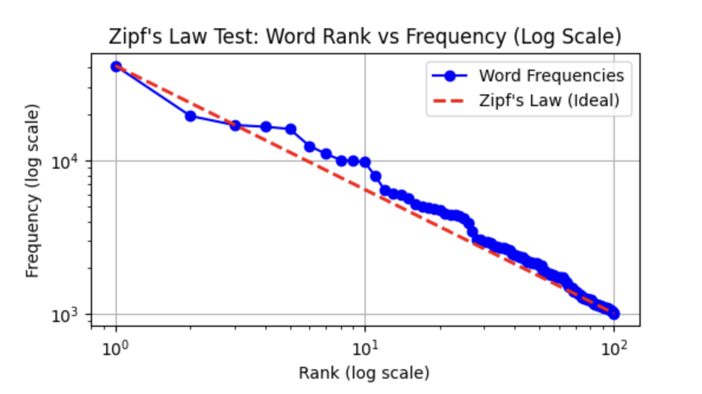
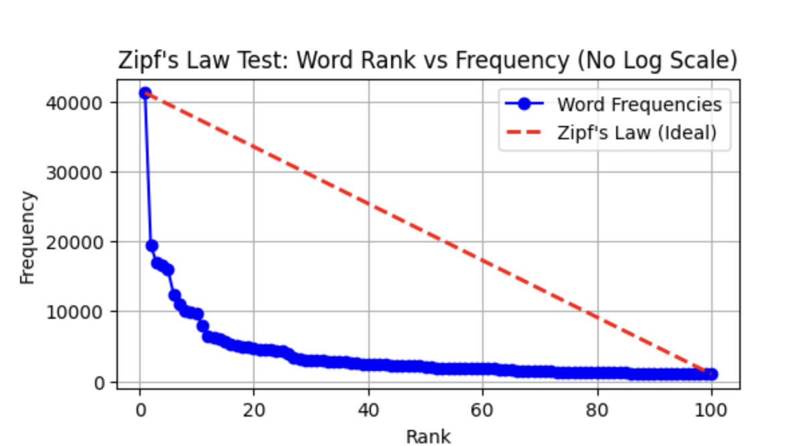
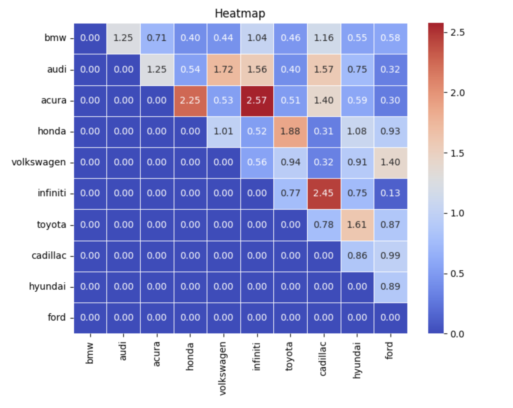
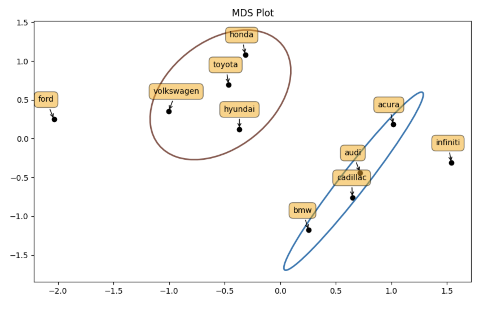
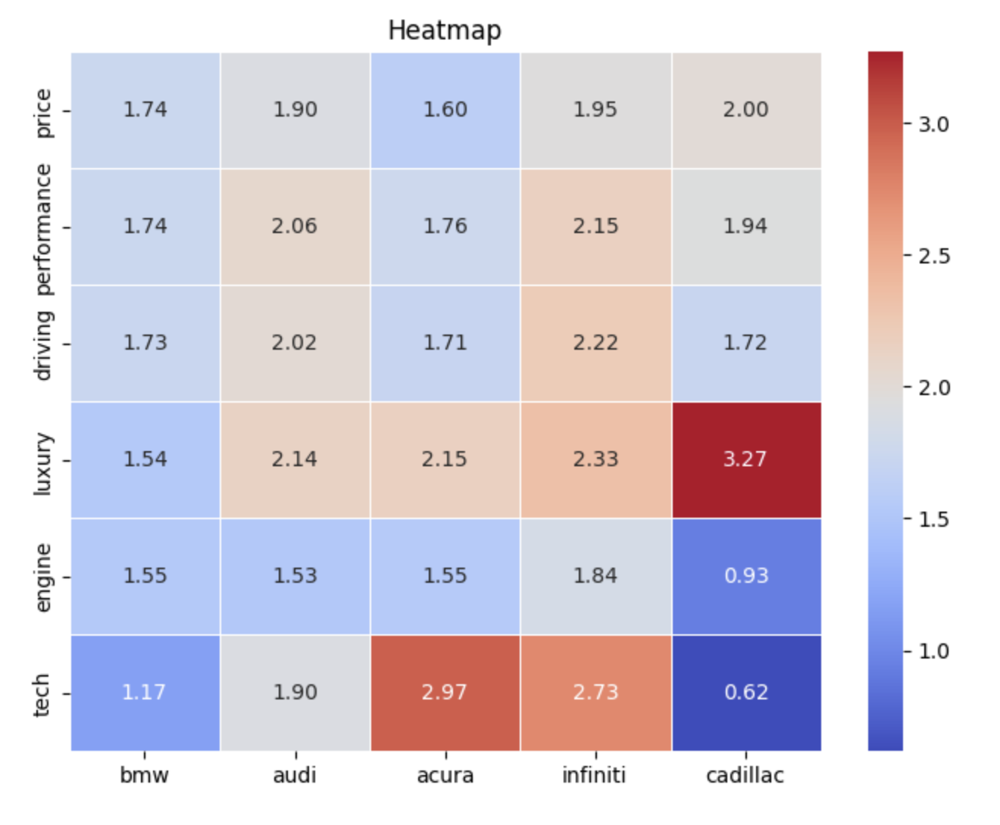
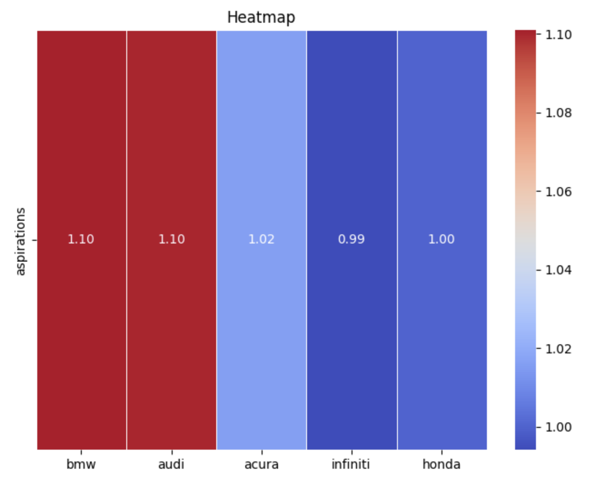

# Unstructured Data Analytics: Competitive Analysis of the Entry-Level Luxury Car Market

## Project Overview
This project was completed for JD Power and Associates to conduct a competitive analysis of the entry-level luxury car market in the USA. The main objective was to analyze social media discussions from Edmunds.com forums to identify customer preferences, brand associations, and attributes that influence brand perception. The analysis included testing Zipf's law, calculating lift ratios, plotting multi-dimensional scaling (MDS) maps, and uncovering key insights into brand switching tendencies and aspirational appeal.

## Team Members
- Ronak Goyal
- Pranav Garg


## Key Highlights
- **Comprehensive Data Collection**: Extracted approximately 5,000 posts from Edmunds.com discussion forums to capture diverse customer opinions.
- **Custom-Built Python Scraper**: Developed to handle complex web structures and ensure robust data collection.
- **Advanced NLP Techniques**: Employed word tokenization, frequency analysis, and custom replacements for model-to-brand mapping.
- **Econometric Analysis**: Validated Zipf's law for the frequency distribution of words within the corpus.
- **Strategic Business Insights**: Provided recommendations for brands to align their marketing strategies based on customer perceptions.

## Project Structure
- **Task A**: Extracting data and testing for Zipf's Law.
- **Task B**: Identifying top 10 brands through word frequency analysis.
- **Task C**: Calculating lift ratios for brand associations.
- **Task D**: Visualizing brand relationships with an MDS plot.
- **Task E**: Insights from Tasks C and D.
- **Task F**: Identifying attributes associated with top brands.
- **Task G**: Strategic advice based on attribute analysis.
- **Task H**: Determining the most aspirational brand based on discussions.

## Key Visuals
### Zipf's Law Test




### Lift Value Heatmap


### MDS Plot


### Brand vs. Attribute Heatmap


### Aspirational Brand Analysis


## Task Details and Functions Used

### Task A: Data Extraction and Zipf's Law Test
- **Description**: Validated Zipf’s law by analyzing word frequency distributions from the extracted data.
- **Functions Used**:
  - `remove_header(input_file, output_file)`: Removes the header from the input CSV.
  - `extract_sentences(file)`: Extracts and cleans sentences from the input data.
  - `write_word_frequencies(clean_token_list, output_file)`: Writes word frequencies to a CSV.
  - `test_zipfs_law(file_path, top_num_words_to_print)`: Tests and plots Zipf's law.
- **Insight**: The analysis supported Zipf's law, showing a power-law distribution in word frequencies.

### Task B: Brand Identification and Frequency Count
- **Description**: Identified the top 10 most discussed brands and normalized car models to their respective brands.
- **Functions Used**:
  - `load_replacements(replacement_file)`: Loads a dictionary of model-to-brand replacements.
  - `replace_words_in_text(text, replacements_dict)`: Replaces car model mentions with brands in text.
  - `process_file(input_file, output_file, replacements_dict)`: Processes the input file to replace words.
  - `print_and_write_top_freq_words(csv_file, replacement_dict, output_file)`: Prints and writes the top 10 frequent words.
- **Insight**: This helped narrow down the most influential brands discussed and laid the groundwork for lift calculations.

### Task C: Lift Ratio Calculation
- **Description**: Measured brand association strength through lift ratio calculations.
- **Functions Used**:
  - `filter_brand_tokens(brand_list, clean_token_list)`: Filters brand tokens from the tokenized list.
  - `co_occurance_freq(word1, word2, clean_token_list, distance)`: Calculates co-occurrence frequency.
  - `get_lift(top_10_brand_df, clean_token_list, dis, word_freq_output)`: Computes the lift matrix and values.
- **Insight**: Revealed strong brand affinities, showing which brands are most often discussed together.

### Task D: Multi-Dimensional Scaling (MDS) Map
- **Description**: Visualized brand proximity using an MDS plot based on lift values.
- **Functions Used**:
  - `replace_zeros_with_diagonal(df)`: Replaces zero values with diagonal values in the DataFrame.
  - `plot_cov_ellipse(cov, pos, nstd=2, ax=None, **kwargs)`: Plots covariance ellipses for brand clusters.
- **Insight**: Identified clusters of brands, highlighting direct competitors and potential market groupings.

### Task F: Attribute Analysis
- **Description**: Mapped attributes to brands and identified which attributes were most associated with which brands.
- **Functions Used**:
  - `get_lift_task_f(top_10_brand_list, top_attribute_list, clean_token_list, dis, word_freq_output)`: Computes the lift matrix for brands and attributes.
- **Insight**: Found that Cadillac was strongly associated with luxury, while Acura and Infiniti led in technology perception.

### Task H: Aspirational Brand Analysis
- **Description**: Assessed brand desirability and aspirational nature based on specific phrases in discussions.
- **Functions Used**:
  - `process_file(input_file, output_file, replacements_dict)`: Processes aspirational phrases for analysis.
  - `get_lift_task_f(top_10_brand_list, ['aspirations'], clean_token_list, dis, word_freq_output)`: Calculates lift values for aspirational brand analysis.
- **Insight**: Identified BMW and Audi as the most aspirational brands, guiding potential marketing and brand positioning strategies.

## Key Insights and Recommendations
- **Clusters and Brand Migration**: The MDS plot revealed clusters among budget-friendly brands (Honda, Toyota, Hyundai) and luxury brands (Acura, Cadillac, BMW, Audi), indicating potential customer migration between these clusters.
- **Aspirational Branding**: BMW, despite lower lift in performance and tech, remains highly aspirational, suggesting the importance of brand perception over actual attribute performance.
- **Marketing Strategy**: Brands like Cadillac, strongly associated with luxury, should leverage this attribute more in their branding, while Acura and Infiniti could focus on tech-driven campaigns to enhance their market positioning.

## Challenges and Unique Approaches
- **Handling of Complex Web Structures**: Developed a Python scraper capable of handling nested comments and varying HTML structures.
- **Custom Model-to-Brand Mapping**: Created a custom replacement system to accurately map car models to brands.
- **Econometric Validation**: Implemented Zipf's law analysis to validate the distribution of word frequencies in the dataset.


### **Summary**:
- **BMW** and **Audi** are seen as aspirational, with customers viewing them as desirable, prestigious brands.
- **Acura** is moderately aspirational, but less so than BMW and Audi.
- **Honda** and **Infiniti** are less associated with aspiration, being seen as practical, reliable choices rather than status-driven purchases.


### AHA Moments!!!

- **BMW** promotes itself as the "Ultimate Driving Machine," but interestingly, the data reveals that BMW has the lowest lift values for attributes like performance, technology, and driving experience. This suggests a disconnect between the brand's image and how customers actually perceive it, indicating that BMW might want to rethink its tagline.
  
- However, when we explore the issue further, it becomes clear that despite this gap in perception, **BMW** still stands out as the most aspirational brand. This insight could guide the brand’s strategy moving forward, helping them better align their messaging with how customers view the brand while leveraging their aspirational appeal.

This shows how each brand is perceived in terms of customer aspiration, which can be useful for positioning and marketing strategies.
## How to Clone the Repository
To clone this project to your local machine, run the following command:

```bash
git clone https://github.com/pranvgarg/Competitive-Analysis-Entry-Level-Luxury-Car-Market.git
